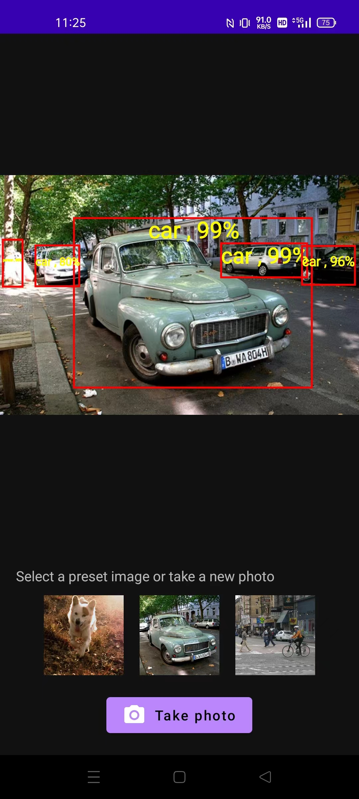
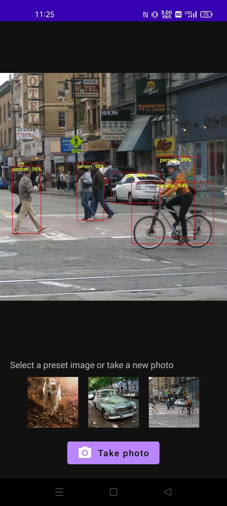

## 基于mobileNet、fasterRcnn的目标检测模型

数据来源于voc2007，共20个分类，这里取其中10类

- aeroplane 
- bicycle
- bird
- bus
- car
- cat
- dog
- motorbike
- person
- train

并将模型转为tflite文件，从而制作成apk在手机上进行目标检测

## 模型转tflite文件记录

- 执行pack.py，由于fasterRcnn是两阶段模型，因此先转为单输入四输出形式（四输出是因为tflite的目标检测例子是四输出，保持一致方便使用其示例代码），然后使用tf.saved_model生成相关文件

- 执行pack_tflite.py，利用第一步生成的相关文件生成.tflite文件

- 执行pack_metadata.py，在第二步生成的tflite文件的基础上生成带元数据的tflite文件

第一步这里特别的一点是，官方例子输出的检测框坐标是(y1,x1),(y2,x2)，不是(x1,y1),(x2,y2)，转化的时候需保持一致

第三步这里特别的一点是使用from tflite_support.metadata_writers import object_detector的时候，在object_detector.py文件里面，其根据输出张量索引获取输出元数据的顺序这块代码，有一段注释（190行附近）：Gets the tensor inidces of tflite outputs and then gets the order of the output metadata by the value of tensor indices. 官方例子中的输出张量index顺序是location、category、score、number of detections，object_detector.py也是按这个顺序写死进行处理的，而本项目代码生成的模型，打断点发现其输出张量index和其不一致，因此如果要使用引入的object_detector库，需要手动将该py文件copy一份，然后将里面metadata_list的赋值顺序改为自己模型的输出张量index顺序，这里copy后的py文件是pack_temp.py

经过以上步骤生成的tflite文件，可直接使用官方例子([使用 TensorFlow Lite (Android) 构建和部署自定义对象检测模型 (google.cn)](https://developers.google.cn/codelabs/tflite-object-detection-android?hl=zh-cn#4))中的安卓代码，直接将tflite文件替换即可

## 效果图

